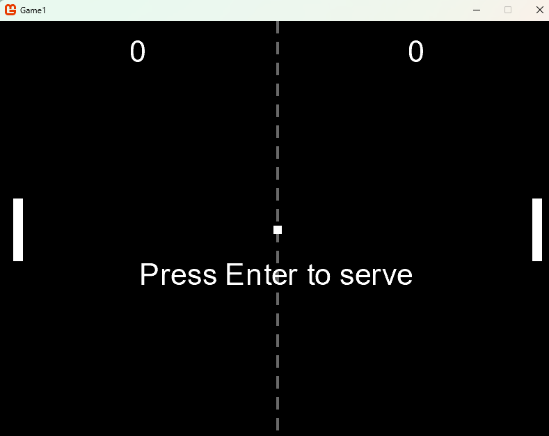

# PONG — MonoGame OOP Teaching Project

A classic two-player PONG game built with **MonoGame DesktopGL** on **.NET 10**, designed as a teaching example for object-oriented programming and event-driven architecture in C#.



## Gameplay

| Player | Up | Down |
|---|---|---|
| Player 1 (left) | `W` | `S` |
| Player 2 (right) | `↑` | `↓` |

Press **Enter** to start and to serve. Press **Escape** to quit.

## Project structure

```
Game1.csproj
Program.cs              ← Entry point, creates and runs the game
Types/
  Game1.cs              ← Orchestrator: creates objects, wires events, calls Update/Draw
  Ball.cs               ← Ball physics, collision detection, fires events
  Paddle.cs             ← Paddle input handling and movement
  ScoreBoard.cs         ← Score tracking, fires ScoreChanged
  GameState.cs          ← Enum: Welcome | WaitingToServe | Playing
  ScoredEventArgs.cs    ← EventArgs for Ball.Scored
  PaddleHitEventArgs.cs ← EventArgs for Ball.PaddleHit
  ScoreChangedEventArgs.cs ← EventArgs for ScoreBoard.ScoreChanged
Content/
  Font.spritefont       ← Bitmap font (Arial 32pt) built by content pipeline
  Content.mgcb          ← MonoGame content pipeline build file
```

## OOP concepts demonstrated

| Concept | Where |
|---|---|
| **Encapsulation** | Each class owns its data — only exposes what others need |
| **Single Responsibility** | `Ball` handles physics, `Paddle` handles input, `ScoreBoard` tracks points |
| **Events & Delegates** | Objects communicate via events — no tight coupling |
| **EventArgs subclasses** | Strongly typed event data (`ScoredEventArgs`, `PaddleHitEventArgs`, `ScoreChangedEventArgs`) |
| **Dependency Injection** | `Paddle` receives its keys via constructor |
| **Nullable reference types** | Enabled project-wide — fields are `null!` until initialised in `Initialize()` |

## Event flow

```
Ball ──────→ Scored          → Game1.OnBallScored  → ScoreBoard.AddPoint()
        ──→ PaddleHit        → Game1.OnPaddleHit   → (extension point: sound)
        ──→ WallHit          → Game1.OnWallHit      → (extension point: sound)
ScoreBoard → ScoreChanged    → Game1.OnScoreChanged → (extension point: win condition)
```

## Getting started

**Prerequisites:** [.NET 10 SDK](https://dotnet.microsoft.com/download)

```powershell
# Run in development
dotnet run

# Debug in VS Code
# Press F5 — uses .vscode/launch.json
```

## Publishing

```powershell
# Builds self-contained executables for Windows, Linux, and macOS
powershell -ExecutionPolicy Bypass -File .\publish.ps1
```

Output:
```
publish\win-x64\Game1.exe        Windows x64
publish\linux-x64\Game1          Linux x64
publish\osx-x64\Game1            macOS Intel
publish\osx-arm64\Game1          macOS Apple Silicon
```

## AI assistance (GitHub Copilot)

This project includes a custom Copilot agent and skills to help work with MonoGame:

| | Name | Use |
|---|---|---|
| 🤖 **Agent** | `monogame-dev` | MonoGame API help, game loop questions, content pipeline |
| 🛠 **Skill** | `/add-game-object` | Add a new entity following the OOP/event pattern |
| 🛠 **Skill** | `/add-screen` | Add a new game screen (Game Over, Pause, etc.) |
| 🛠 **Skill** | `/add-sound-effect` | Add audio via the content pipeline |
| 🛠 **Skill** | `/debug-collision` | Draw hitboxes to visualise collision detection |

