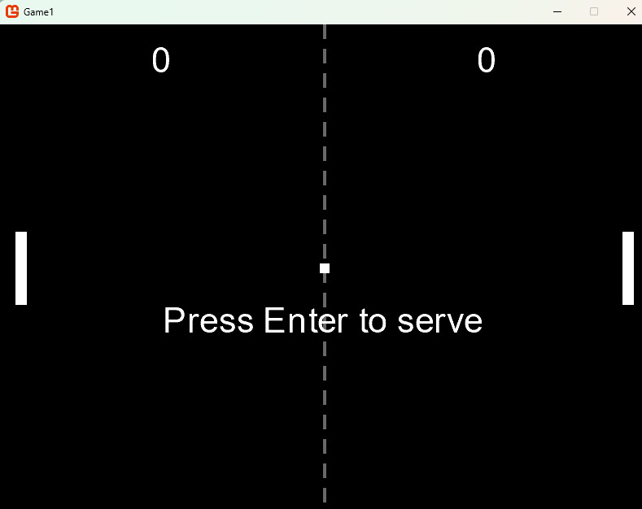

# PONG — MonoGame OOP Teaching Project

A classic two-player PONG game built with **MonoGame DesktopGL** on **.NET 10**, designed as a teaching example for object-oriented programming and event-driven architecture in C#.



## Gameplay

| Player           | Up  | Down |
| ---------------- | --- | ---- |
| Player 1 (left)  | `W` | `S`  |
| Player 2 (right) | `↑` | `↓`  |

Press **Enter** to start and to serve. Press **Escape** to quit.

## Project structure

```
Pong.csproj
Program.cs              ← Entry point, creates and runs the game
Types/
  Game1.cs              ← Orchestrator: creates objects, wires events, calls Update/Draw
  Ball.cs               ← Ball physics, collision detection, fires events
  Paddle.cs             ← Paddle input handling and movement
  ScoreBoard.cs         ← Score tracking, fires ScoreChanged
  GameState.cs          ← Enum: Welcome | WaitingToServe | Playing
  ScoredEventArgs.cs    ← EventArgs for Ball.Scored
  PaddleHitEventArgs.cs ← EventArgs for Ball.PaddleHit
  ScoreChangedEventArgs.cs ← EventArgs for ScoreBoard.ScoreChanged
Content/
  Font.spritefont       ← Bitmap font (Arial 32pt) built by content pipeline
  Content.mgcb          ← MonoGame content pipeline build file
tests/
  Pong.Tests/
    Pong.Tests.csproj   ← xUnit test project
    ScoreBoardTests.cs  ← Tests for scoring logic and events
```

## OOP concepts demonstrated

| Concept                      | Where                                                                                        |
| ---------------------------- | -------------------------------------------------------------------------------------------- |
| **Encapsulation**            | Each class owns its data — only exposes what others need                                     |
| **Single Responsibility**    | `Ball` handles physics, `Paddle` handles input, `ScoreBoard` tracks points                   |
| **Events & Delegates**       | Objects communicate via events — no tight coupling                                           |
| **EventArgs subclasses**     | Strongly typed event data (`ScoredEventArgs`, `PaddleHitEventArgs`, `ScoreChangedEventArgs`) |
| **Dependency Injection**     | `Paddle` receives its keys via constructor                                                   |
| **Nullable reference types** | Enabled project-wide — fields are `null!` until initialised in `Initialize()`                |

## Event flow

```
Ball ──────→ Scored          → Game1.OnBallScored  → ScoreBoard.AddPoint()
        ──→ PaddleHit        → Game1.OnPaddleHit   → (extension point: sound)
        ──→ WallHit          → Game1.OnWallHit      → (extension point: sound)
ScoreBoard → ScoreChanged    → Game1.OnScoreChanged → (extension point: win condition)
```

## Getting started

**Prerequisites:** [.NET 10 SDK](https://dotnet.microsoft.com/download)

```powershell
# Run in development
dotnet run

# Run the tests
dotnet test .\tests\Pong.Tests\Pong.Tests.csproj

# Debug in VS Code
# Press F5 — uses .vscode/launch.json
```

## Testing

The xUnit suite covers scoring, score-change events, and validation of player numbers. Rendering and the MonoGame window are verified manually.

## Ideas and exercises

See [possiblechanges.md](possiblechanges.md) for small visual changes, game features, bots, external API control, and larger project ideas with acceptance criteria.

## Static analysis

[`IDisposableAnalyzers`](https://github.com/DotNetAnalyzers/IDisposableAnalyzers) runs during every build. The `IDISP003` and `IDISP006` diagnostics are treated as errors, so owned resources must be disposed correctly before the project and tests can build.

The repository must always build with **0 warnings and 0 errors**. Analyzer diagnostics should be fixed rather than suppressed.

```powershell
dotnet build .\Pong.csproj --no-incremental
```

## Publishing

```powershell
# Builds self-contained executables for Windows, Linux, and macOS
powershell -ExecutionPolicy Bypass -File .\publish.ps1
```

Output:
```
publish\win-x64\Pong.exe        Windows x64
publish\linux-x64\Pong          Linux x64
publish\osx-x64\Pong            macOS Intel
publish\osx-arm64\Pong          macOS Apple Silicon
```

## AI assistance (GitHub Copilot)

VS Code with GitHub Copilot is the default setup. The original instructions,
agent and skills live in `.github/` and are the only maintained versions.

|             | Name                | Use                                                      |
| ----------- | ------------------- | -------------------------------------------------------- |
| 🤖 **Agent** | `monogame-dev`      | MonoGame API help, game loop questions, content pipeline |
| 🛠 **Skill** | `/add-game-object`  | Add a new entity following the OOP/event pattern         |
| 🛠 **Skill** | `/add-screen`       | Add a new game screen (Game Over, Pause, etc.)           |
| 🛠 **Skill** | `/add-sound-effect` | Add audio via the content pipeline                       |
| 🛠 **Skill** | `/debug-collision`  | Draw hitboxes to visualise collision detection           |

### Claude Code (optional)

Students using Claude Code can generate its configuration with Windows PowerShell
5.1 or PowerShell 7, without installing extra modules:

```powershell
powershell -ExecutionPolicy Bypass -File .\generate-claude.ps1
```

For PowerShell 7, use `pwsh -File ./generate-claude.ps1` instead.
Start a new Claude Code session in the project after generation.

| Copilot source                                 | Generated Claude Code output                         |
| ---------------------------------------------- | ---------------------------------------------------- |
| `.github/copilot-instructions.md`              | `CLAUDE.md`                                          |
| `.github/skills/` (including supporting files) | `.claude/skills/`                                    |
| `.github/agents/*.agent.md`                    | `.claude/agents/*.md` with translated metadata/tools |

Rerun the script after updating the originals, including after a pull. Generated
outputs are ignored by Git. Do not edit them: regeneration replaces `CLAUDE.md`
and the entire generated skills/agents directories, removing obsolete entries.
Other Claude files, such as `.claude/settings.local.json`, are left untouched.
The first run refuses to overwrite existing configuration at the output paths.

Agent conversion supports the current two-field frontmatter format (double-quoted
description and inline tool list). Unsupported formats or tool groups stop
generation before existing outputs are replaced. VS Code-specific settings and
workflows are not converted.

Run the generator's checks with:

```powershell
powershell -ExecutionPolicy Bypass -File .\tests\Test-ClaudeGeneration.ps1
```

